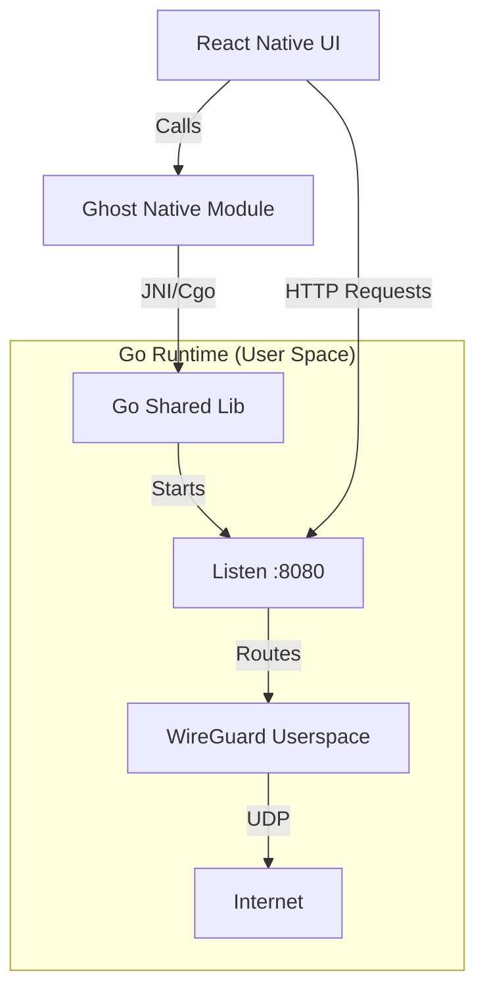

# Phase 5: Mobile Platforms (User-Space Tunneling)

## Overview

This phase implements consumer-facing mobile applications using **React Native with Expo**. 

Unlike Phase 1-3 which focuses on a system-level network interface (TUN/TAP), the mobile implementation operates entirely in **user space**. It does **not** use the OS-level VPN APIs (`VpnService` on Android or `NetworkExtension` on iOS). 

Instead, it embeds the Ghost Core node as a library, which starts a local SOCKS5 or HTTP CONNECT proxy server. The mobile application (and any embedded WebView) routes traffic explicitly through this local proxy.

---

## Architecture



## 5.1 Go Mobile Bindings (`cmd/ghost-mobile/`)

We use `gomobile bind` to export the control API. The Go runtime manages the lifecycle of the tunnel and the local proxy server.

### Go Exports (`mobile.go`)
```go
package mobile

import "C"

// Config passes initial settings including signaling server, keys, and listening ports.
// {
//   "privateKey": "...",
//   "listenPort": 8080,
//   "signalingUrl": "..."
// }
func StartNode(configJSON string) error

// StopNode shuts down the tunnel and closes the local proxy listener.
func StopNode() error

// GetState returns JSON status (connected peers, bytes transferred).
func GetState() string
```

### Internal Implementation
- **No TUN Device**: The `wireguard-go` device involves a "netstack" or virtual implementation that doesn't attach to a kernel interface.
- **Proxy Listener**: The HTTP/WebSocket Proxy from Phase 4 is initialized with a `net.Listener` on localhost (e.g., 127.0.0.1:0 to pick a free port, returning it to the caller).
- **Transport**: The Proxy uses `tunnel.DialContext` effectively bridging the local TCP listener to the remote WireGuard peer.

---

## 5.2 React Native Native Modules (Expo)

We create a lightweight Native Module to bridge the Go functions to JavaScript. Since we are not using `VpnService`, we don't need complex Config Plugins for entitlements. Standard Expo Development Builds are sufficient to link the `.aar` / `.xcframework`.

### Android Module (`GhostModule.kt`)
```kotlin
class GhostModule(reactContext: ReactApplicationContext) : Module() {
    // Defines the JS API
    override fun definition() = ModuleDefinition {
        Name("Ghost")

        Function("start") { config: String ->
            // Call into Go shared library
            try {
                Mobile.startNode(config)
                return@Function true
            } catch (e: Exception) {
                throw e
            }
        }

        Function("stop") {
            Mobile.stopNode()
        }
        
        Function("getState") {
            return@Function Mobile.getState()
        }
    }
}
```

### iOS Module (`GhostModule.swift`)
```swift
public class GhostModule: Module {
  public func definition() -> ModuleDefinition {
    Name("Ghost")

    Function("start") { (config: String) in
      var error: NSError?
      MobileStartNode(config, &error)
      if let error = error {
        throw error
      }
    }

    Function("stop") {
      MobileStopNode(nil)
    }
    
    Function("getState") {
      return MobileGetState()
    }
  }
}
```

---

## 5.3 Application Logic & Usage

### Connection Flow
1. **User Login**: Authenticate with coordination server (REST/WebSocket).
2. **Peer Discovery**: Receive list of peers and their public keys.
3. **Start Node**: Call `Ghost.start(config)`.
   - Go Runtime starts WireGuard engine.
   - Go Runtime starts HTTP Proxy on `127.0.0.1:0` (random port).
   - Go Runtime reports the actual port back (via state event or return value).
4. **App Usage**:
   - To access a service on Peer A (`10.0.0.5`), the app sends a request to:
     `http://127.0.0.1:{LOCAL_PORT}/mesh/10.0.0.5/api/resource`
     (Assuming the Phase 4 proxy supports path-based routing).

### Background Execution
Since we are not a VPN Service, the OS may suspend the app when backgrounded.
- **Android**: Use a Foreground Service (Data Sync type) if we need to keep the tunnel alive for notifications or background syncing.
- **iOS**: Limited background execution. The tunnel will likely pause when the app is backgrounded unless using specific background modes (User enters 'Background Fetch' or 'Audio' hacks, though not recommended for App Store compliance). **Expectation:** The tunnel is primarily active while the app is in foreground.

---

## 5.4 Build Workflow

### Steps
1. **Compile Go Mobile Lib**:
   ```bash
   # Android
   gomobile bind -target=android -o android/libs/ghost.aar ./cmd/ghost-mobile
   
   # iOS
   gomobile bind -target=ios -o ios/Ghost.xcframework ./cmd/ghost-mobile
   ```
2. **Configure Expo**:
   Link the binaries in `app.json` or `expo-build-properties` if necessary, or simply place them where the native modules can find them.
3. **Dev Build**:
   ```bash
   npx expo run:android
   npx expo run:ios
   ```

---

## Dependencies
- `golang.org/x/mobile`
- `expo-modules-core`
